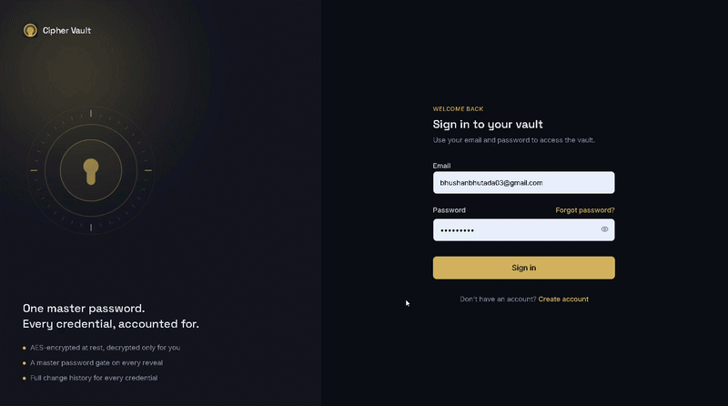
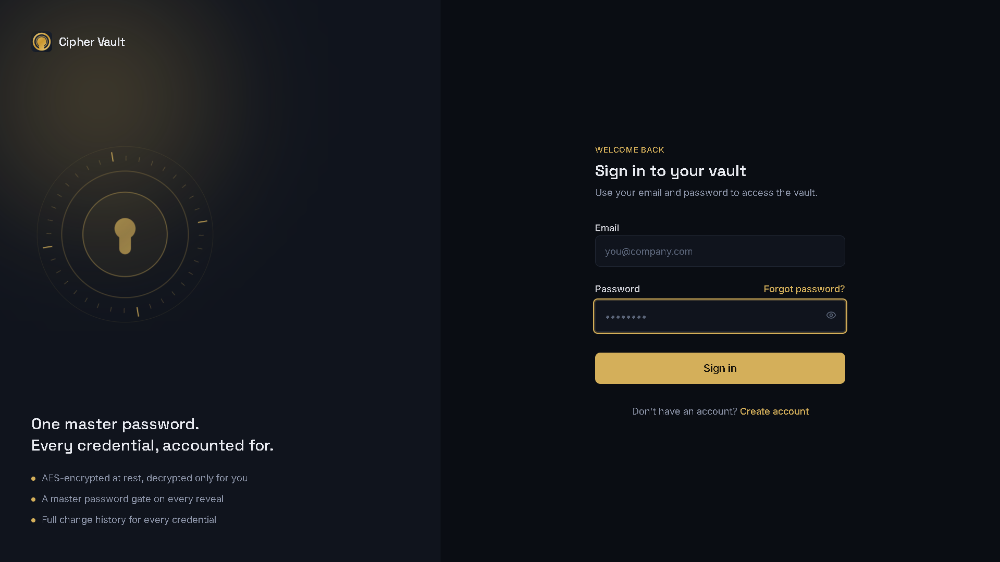
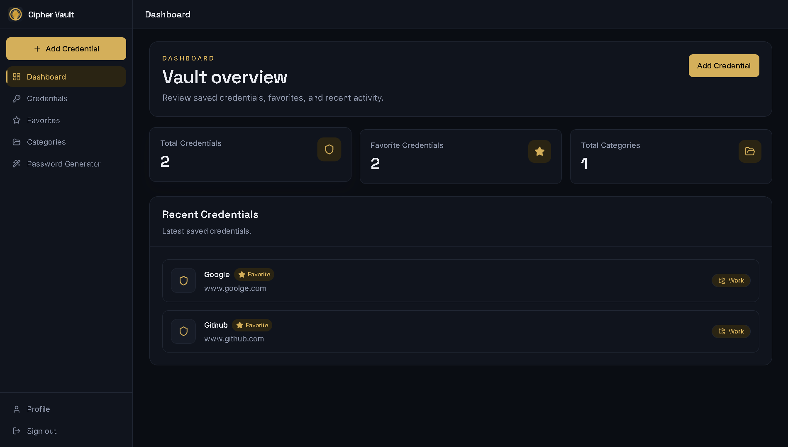
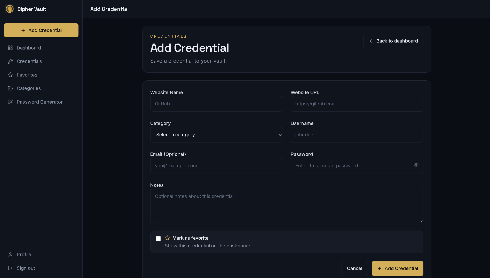
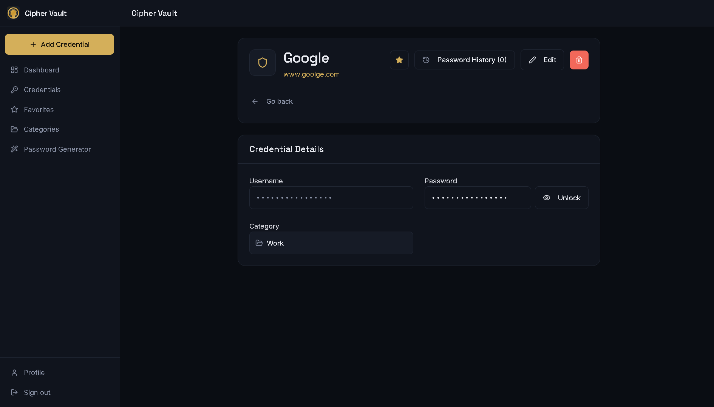
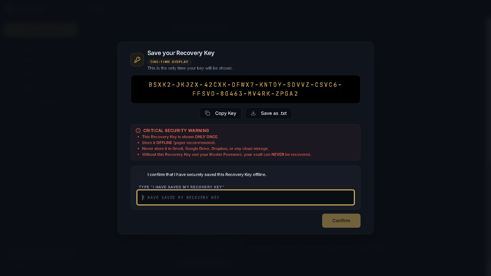
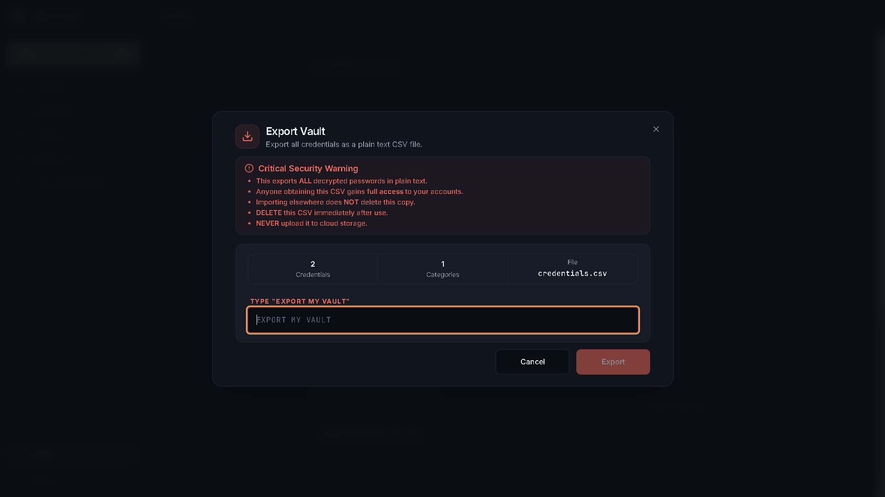

# Cipher Vault

A full-stack password management application built using Spring Boot, React, and MySQL to securely store, organize, and manage website credentials. The application combines modern authentication, encryption, and secure credential handling with an intuitive user interface.

---

## Badges


---

## Overview

Cipher Vault is a secure credential management platform designed to provide encrypted storage for website credentials while maintaining a clean and modern user experience.

The application implements authentication, authorization, password encryption, master password verification, recovery mechanisms, and dashboard analytics using a layered Spring Boot architecture with a React frontend.

---

## Demo

### Live Demonstration

<p align="center">
  
</p>

**Full Demonstration (53 Seconds)**

The complete walkthrough is available here:

```
assets/demo/cipher-vault-demo.mp4
```

---

## Screenshots

### Login

<p align="center">

</p>

---

### Dashboard

<p align="center">

</p>

---

### Add Credential

<p align="center">

</p>

---

### Credential Details

<p align="center">

</p>

---

### Recovery Key

<p align="center">

</p>

---

### Export Credentials

<p align="center">

</p>

---

## Features

### Authentication

- User Registration with Email Verification
- Secure Login using JWT Authentication
- Spring Security based Authorization
- Master Password Verification
- Vault Unlock and Recovery Key Support
- Forgot Password with Email OTP
- Password Reset Workflow

---

### Credential Management

- Store Website Credentials Securely
- AES Encrypted Password Storage
- Create, Update, Delete Credentials
- Reveal Password after Master Password Verification
- Password History Tracking
- Search Credentials
- Favorite Credentials
- Website Favicon Integration
- Category-based Organization

---

### Dashboard

- Credential Statistics
- Favorite Credentials Summary
- Category Overview
- Recent Credentials
- Quick Navigation

---

### Password Utilities

- Secure Password Generator
- Password Strength Indicator
- Password Copy Functionality

---

### Data Export

- Export Credentials
- Export Confirmation Dialog
- Secure Export Workflow

---

### Security

- JWT Authentication
- Spring Security
- AES Encryption
- BCrypt Password Hashing
- Master Password Verification
- Recovery Key Mechanism
- Email OTP Verification
- Password History
- Global Exception Handling
- Input Validation

---

## Technology Stack

| Category | Technologies |
|-----------|--------------|
| Backend | Spring Boot, Java 21 |
| Frontend | React, TypeScript, Vite |
| Database | MySQL |
| Security | Spring Security, JWT, BCrypt, AES |
| ORM | Spring Data JPA (Hibernate) |
| Build Tool | Maven |
| Containerization | Docker, Docker Compose |
| API Documentation | Swagger (OpenAPI) |
| Version Control | Git, GitHub |

---

## Architecture

```
                    React Frontend
                           │
                           ▼
                    REST API Layer
                           │
                           ▼
                 Spring Boot Controllers
                           │
                           ▼
                    Service Layer
                           │
                           ▼
                  Repository Layer (JPA)
                           │
                           ▼
                        MySQL Database
```

### Backend Architecture

```
Client
   │
   ▼
Controllers
   │
   ▼
Services
   │
   ▼
Repositories
   │
   ▼
MySQL Database
```

The application follows a layered architecture that separates presentation, business logic, and data access, improving maintainability, scalability, and testability.

---

## Security Architecture

```
User
 │
 ▼
JWT Authentication
 │
 ▼
Spring Security Filter
 │
 ▼
Authorization
 │
 ▼
Master Password Verification
 │
 ▼
AES Encryption / Decryption
 │
 ▼
MySQL
```

Sensitive credentials remain encrypted within the database and are decrypted only after successful master password verification.


## Project Structure

```
Cipher-Vault
│
├── backend
│   ├── src
│   │   ├── config
│   │   ├── controller
│   │   ├── dto
│   │   ├── encryption
│   │   ├── entity
│   │   ├── exception
│   │   ├── repository
│   │   ├── security
│   │   ├── service
│   │   └── resources
│   │
│   └── pom.xml
│
├── frontend
│   ├── src
│   │   ├── api
│   │   ├── components
│   │   ├── context
│   │   ├── hooks
│   │   ├── layouts
│   │   ├── pages
│   │   ├── services
│   │   ├── types
│   │   └── utils
│   │
│   └── package.json
│
├── assets
│   ├── demo
│   └── screenshots
│
└── README.md
```

---

# REST API Modules

| Module | Functionality |
|----------|---------------|
| Authentication | Register, Login, Email Verification |
| Vault | Unlock Vault, Recovery Key Management |
| Credentials | Create, Read, Update, Delete Credentials |
| Categories | Manage Credential Categories |
| Dashboard | Statistics & Recent Credentials |
| Profile | Update Profile & Change Password |
| Export | Secure Credential Export |

---

# Getting Started

## Clone Repository

```bash
git clone https://github.com/bhushanbhutada03/Cipher_Vault.git
```

---

## Navigate to Project

```bash
cd Cipher_Vault
```

---

# Backend Setup

## Configure Environment Variables

Create an environment configuration based on your local setup.

Typical configuration includes:

- Database Connection
- JWT Secret
- AES Secret Key
- Email Credentials

---

## Start MySQL

Ensure a MySQL server is running before starting the backend.

---

## Run Backend

```bash
cd backend
./mvnw spring-boot:run
```

or

```bash
mvn spring-boot:run
```

Backend starts at

```
http://localhost:8080
```

---

# Frontend Setup

Install dependencies

```bash
cd frontend
npm install
```

Run development server

```bash
npm run dev
```

Frontend starts at

```
http://localhost:5173
```

---

# Docker Deployment

The complete application can also be started using Docker Compose.

```bash
docker compose up --build
```

This starts

- Spring Boot Backend
- React Frontend
- MySQL Database

---

# API Documentation

Swagger UI is available after running the backend.

```
http://localhost:8080/swagger-ui/index.html
```

---

# Development Highlights

- Layered Spring Boot Architecture
- RESTful API Design
- Secure Authentication & Authorization
- AES-based Credential Encryption
- Relational Database Design
- Dockerized Development Environment
- Modular React Component Architecture

---

# Design Principles

The application is designed around modern backend engineering principles:

- Separation of Concerns
- Layered Architecture
- Reusable Components
- Secure Credential Handling
- Clean REST API Design
- Modular Code Organization
- Maintainable Project Structure

## Future Enhancements

The following features are planned for future releases:

- Secure Notes Management
- Encrypted Document Storage (PDF, Images, Files)
- Secure Payment Card Vault
- Browser Extension for One-Click Credential Autofill

---

# Key Highlights

- Full-Stack Application Development
- Layered Spring Boot Architecture
- RESTful API Design
- JWT Authentication & Spring Security
- AES Encryption for Secure Credential Storage
- Relational Database Design using MySQL
- Dockerized Development Environment
- Responsive React User Interface
- Production-Oriented Project Structure

---

# Learning Outcomes

This project strengthened practical knowledge of:

- Spring Boot Application Development
- REST API Design
- Authentication & Authorization
- Database Modeling
- SQL Query Optimization
- Docker Containerization
- Secure Software Development
- Full-Stack System Design
- Git & GitHub Workflow

---

# Repository Information

| Property | Value |
|-----------|-------|
| Language | Java |
| Backend | Spring Boot |
| Frontend | React + TypeScript |
| Database | MySQL |
| Authentication | JWT |
| Security | Spring Security + AES |
| Containerization | Docker |
| Build Tool | Maven |
| API Documentation | Swagger OpenAPI |

---

# Author

**Bhushan Bhutada**

Computer Science and Engineering Student

GitHub

https://github.com/bhushanbhutada03

LinkedIn

https://www.linkedin.com/in/bhushanbhutada03/

Email

bhushanbhutada03@gmail.com

---

# License

This project is intended for educational and portfolio purposes.

---

# Acknowledgements

This project was developed to strengthen practical knowledge of modern backend engineering, secure software development, and full-stack application design using the Spring ecosystem.

---

If you found this project useful, consider giving it a ⭐ on GitHub.
